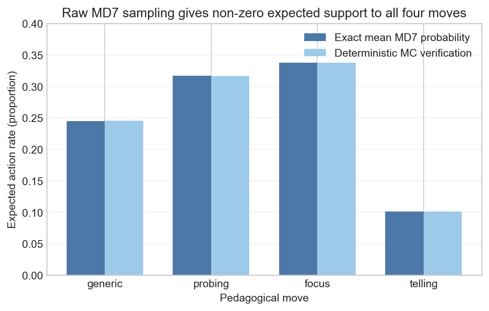
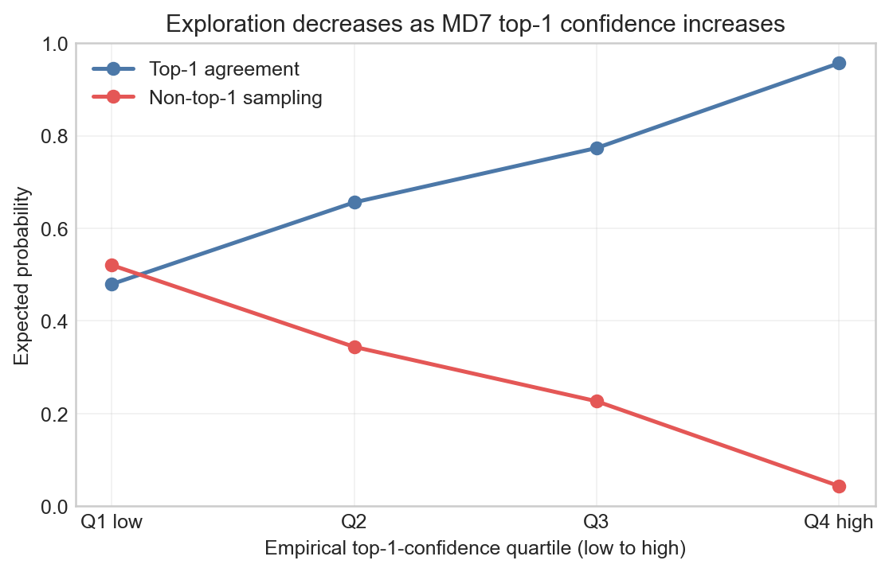
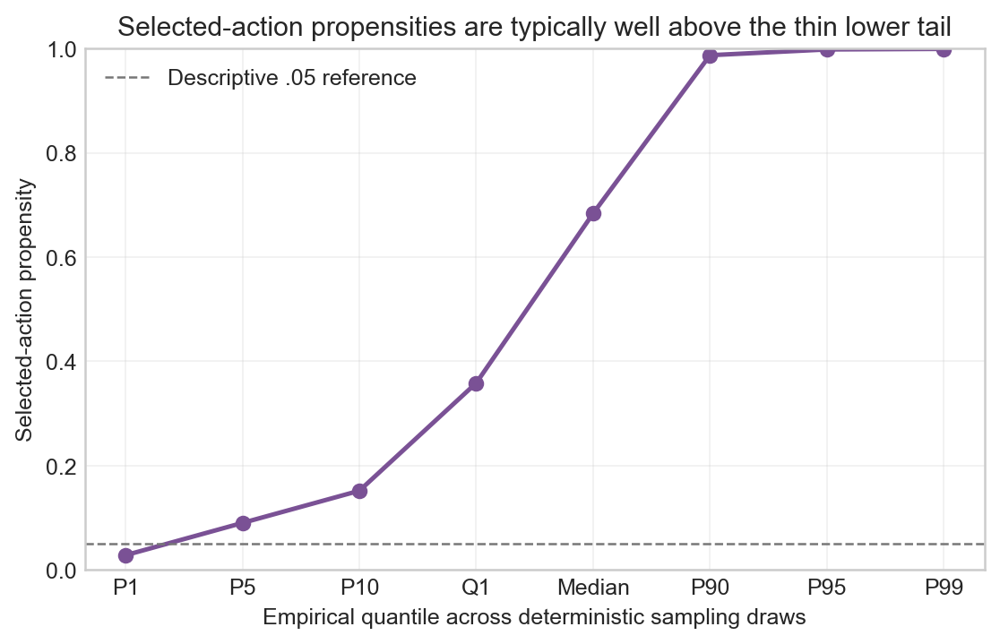
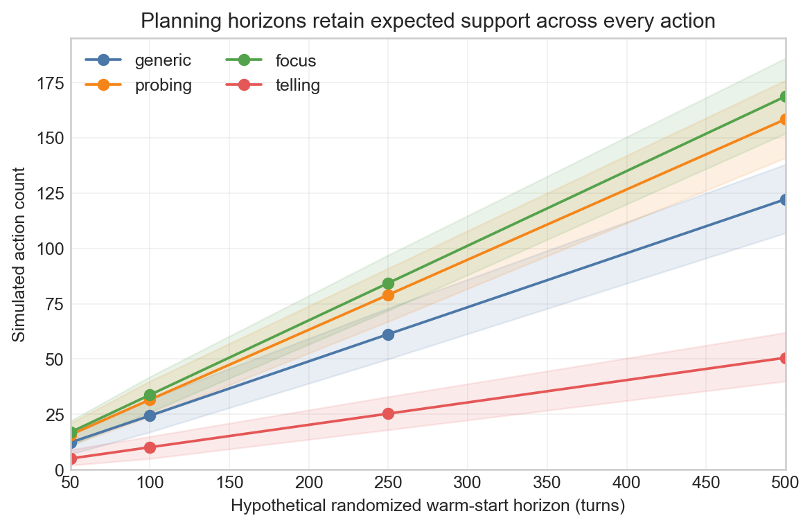

# RANDOMIZED_WARMSTART decision evidence

## Decision 1: active local research mode

### Question

Which implemented Turn-LinTS operating mode should collect the next real
prospective observations?

### Alternatives

| Alternative | Actual Tutor move | Evidence produced | Posterior updates | Suitability now |
|---|---|---|---:|---|
| SHADOW | Frozen MD7 top-1 | Hypothetical LinTS choice only | 0 | Cannot produce randomized treatments or known randomized propensities |
| RANDOMIZED_WARMSTART | Sample from the complete raw MD7 vector | Genuine `(x_t, action, propensity, reward)` observations | 0 | Candidate supported by the completed offline audit |
| LIVE | Turn-LinTS posterior sample | Adaptive-policy observations | Enabled | Premature: no audited warm-start initialization exists |

### Exact decision criterion

Activate `RANDOMIZED_WARMSTART` only if the completed audit shows all of the
following without modifying the raw MD7 distribution:

1. meaningful non-deterministic support across all four actions;
2. no widespread pathological selection of extremely low-propensity actions;
3. decreasing exploration as MD7 confidence increases;
4. semantically plausible multi-action mass in reviewed ambiguous states; and
5. a runtime contract that logs exact treatment propensity while guaranteeing
   zero Turn-LinTS posterior updates.

### Evidence

The offline audit contained **98 pre-action states from 15 attempts** and
**392 context/action probabilities**. Exact expectations were verified with
**401,408 deterministic sampling draws**. Practical-horizon intervals used
**10,000 replicates per horizon**.

| Statistic | generic | probing | focus | telling |
|---|---:|---:|---:|---:|
| Exact expected action rate | 24.467% | 31.665% | 33.733% | 10.135% |
| Deterministic MC rate | 24.541% | 31.602% | 33.745% | 10.112% |
| Exact expected count at N=100 | 24.47 | 31.67 | 33.73 | 10.14 |

Expected MD7 top-1 agreement was **71.329%** and expected deviation was
**28.671%**. Deviation fell from **52.058%** in the lowest top-1-confidence
quartile to **4.347%** in the highest. The sampled-action propensity median was
**0.6837**; observed sampling frequencies below `.01`, `.025`, and `.05` were
**0.179%**, **0.853%**, and **2.025%**, respectively.

### Figures

**Figure 1. Expected versus simulated action rates.** The y-axis starts at
zero. Exact rates use all 98 states; simulation uses 401,408 deterministic
draws. Notice that all four moves retain non-zero support and simulation closely
matches the analytic expectation.

**Figure 2. MD7 confidence and randomized deviation.** Each quartile contains
24 or 25 of the 98 states. Notice that non-top-1 sampling decreases monotonically
as top-1 confidence rises; the chart describes policy behavior, not causal
effects.

**Figure 3. Selected-action propensity quantiles.** Quantiles summarize
401,408 deterministic draws. The `.05` line is descriptive only and is not a
filter. Notice that the very-low-propensity region is a thin tail rather than
the typical assignment regime.

**Figure 4. Planning-horizon coverage.** Lines are simulation means and shaded
bands are P5-P95 across 10,000 replicates per horizon. Horizons are ordered
planning summaries, not stopping targets. Notice that expected support grows
for every action, including telling, while unequal rates remain visible.

### Decision

Activate the local research Tutor in `RANDOMIZED_WARMSTART`. Do not activate
`LIVE`.

### Why

The evidence satisfies the exact criterion: raw MD7 sampling preserves strong
preferences, explores materially in uncertain states, supports all four moves,
and rarely selects the thin low-propensity tail. The already-tested runtime
records exact assignment probabilities and prevents posterior updates.

### Limitations

- The 98 states came from 15 prior attempts and may not represent future users,
  skills, or dialogue distributions.
- Expected coverage and Monte Carlo results are planning evidence, not proof of
  pedagogical benefit or causal treatment effects.
- Semantic review was small and qualitative.
- Extreme inverse-propensity weights remain possible in a thin tail.
- No real randomized observation existed at activation time, so actual support,
  context completeness, and reward distributions remain unknown.

### Next implication

Collect prospective observations and inspect raw readiness evidence later.
Retain propensities for future policy evaluation; do not use unstabilized
extreme inverse-propensity estimates to make learning claims.

## Decision 2: collection lineage

### Question

Should real randomized events reuse an existing SHADOW/LIVE lineage or use the
prepared dedicated warm-start lineage?

### Alternatives

| Alternative | Initial event rows | Initial pending rows | Initial posterior updates | Provenance risk |
|---|---:|---:|---:|---|
| Reuse `turn_lints_shadow_full_headroom_v1` | Existing SHADOW history | Existing lineage state | 0 | Mixes hypothetical SHADOW actions with randomized treatments |
| Reuse a LIVE/legacy state | Not applicable | Not applicable | Potentially non-zero | Mixes policy semantics and update histories |
| Dedicated `turn_lints_randomized_warmstart_v1` | 0 | 0 | 0 | Clean, mode-specific provenance |

### Exact decision criterion

Use a lineage only if its manifest identifies the randomized mode and behavior
policy, its policy state matches the frozen selector/reward/context contract,
and it begins with zero events, pending actions, applied update IDs, and arm
updates.

### Evidence

| Verified field | Value |
|---|---|
| Data mode | `real` |
| Lineage schema | `adaptmath_randomized_warmstart_lineage_v1` |
| Event schema | `adaptmath_turn_lints_event_v4` |
| Behavior policy | `md7_r2_probability_proportional_v1` |
| Selector | `MD7-R2-TELL-C1 epoch 2` |
| Context | `S+K+L+H+Q`, 22 ordered features |
| Reward | `headroom_normalized` |
| Initial completed/pending rows | `0 / 0` |
| Initial update count | `0` |

### Figures

No additional chart is appropriate: all baseline counts are zero and the
decision is a categorical provenance check. Figures 1-4 support the upstream
choice of behavior policy, not lineage isolation.

### Decision

Use only `adaptive-math-tutor/backend/runtime/turn_lints_randomized_warmstart_v1/`.

### Why

This preserves an unambiguous boundary between observed randomized treatments,
SHADOW hypotheticals, LIVE actions, and legacy LinTS state.

### Limitations

A clean lineage guarantees provenance, not future data quality. Runtime crashes,
censoring, sparse arms, missing context blocks, or limited learner/skill breadth
can still reduce readiness.

### Next implication

Run the read-only readiness command periodically and inspect counts rather than
merging lineages or rewriting historical records.

## Decision 3: learning and stopping behavior

### Question

Should observations update Turn-LinTS online or trigger an automatic fixed-N
stop during this phase?

### Alternatives

| Choice | Posterior changes | Scientific effect |
|---|---:|---|
| Online updates | Yes | Changes the behavior policy during collection; outside this phase |
| Collection-only, fixed-N auto-stop | No | Preserves policy but invents an unaudited sufficiency threshold |
| Collection-only, descriptive readiness | No | Preserves policy and exposes empirical support/completeness for later review |

### Exact decision criterion

The collection phase must leave every `A` matrix and `b` vector unchanged,
retain zero arm-update counts, and encode no automatic stopping threshold.
Readiness must report raw randomized action support, grouped coverage, context
completeness, propensities, rewards, censoring/failures, overrides, and update
counts.

### Evidence

At activation, the prepared state had **0 total updates**, **0 applied update
IDs**, and **0 updates for each of four arms**. The readiness baseline reported
**0 randomized actions**, **0 resolved rewards**, **0 overrides**, **0 pending
rows**, **0 behavior-policy/propensity contract violations**, and
`automatic_stopping_threshold = null`.

### Figures

Figure 4 shows uncertainty at N=50/100/250/500, but those horizons are planning
summaries only. A zero-update bar chart would be decorative and is therefore not
included.

### Decision

Collect without online Turn-LinTS learning and without an automatic fixed-N
stopping rule.

### Why

This keeps assignment equal to the frozen raw MD7 distribution and reserves
posterior initialization and context comparison for later, explicitly audited
analyses.

### Limitations

Descriptive readiness does not itself identify a sufficient sample size, prove
overlap for every subgroup, or validate a final LIVE context.

### Next implication

Future analysis will group by attempt and compare the preregistered context
sets using `HEADROOM_NORMALIZED` as primary reward and raw delta only as a
secondary robustness analysis.

## Interpretation guardrails

BKT changes are belief updates, not ground-truth learning effects. MRB1 remains
an auxiliary noisy Tutor-response critic and is not the scalar reward.
Prospective context ablation will be predictive rather than causal. None of the
figures establishes causality.
